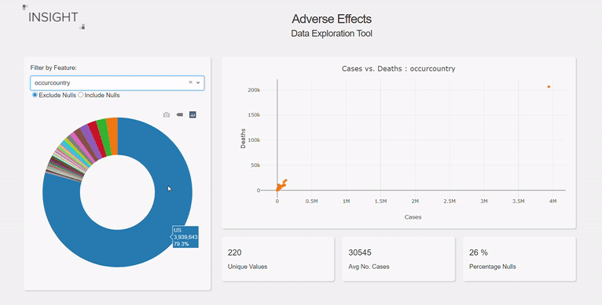
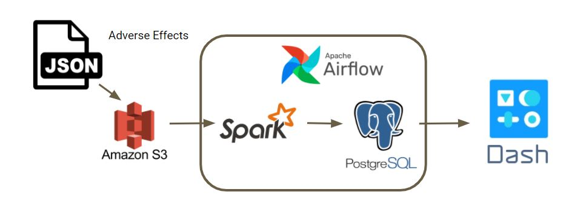
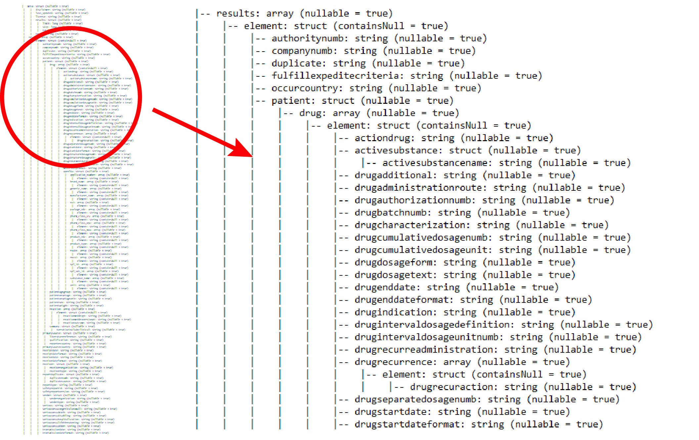
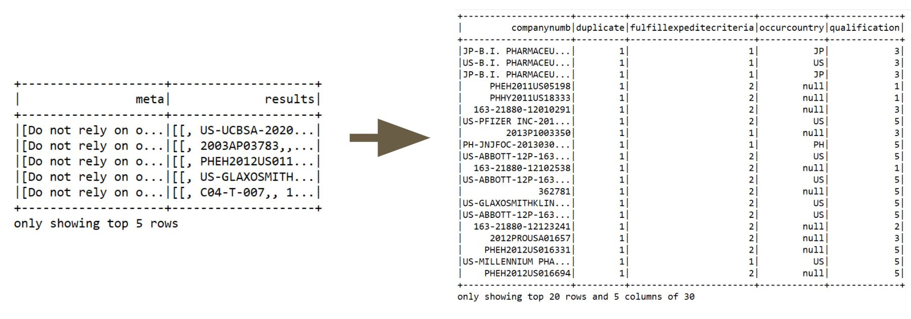
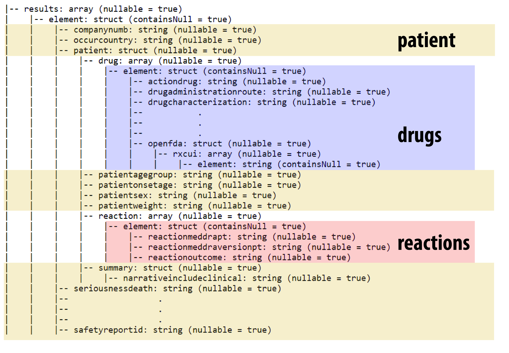
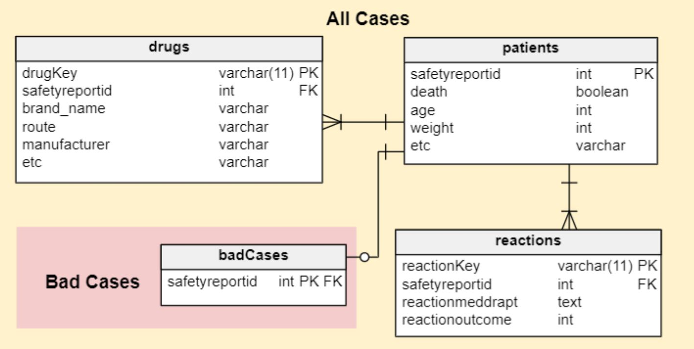

# Adverse Effects
### Improving Patient Outcomes for Prescribed Medication

The presentation slides can be found [here](https://docs.google.com/presentation/d/1s17D2VxaNppbjIhvesi7fQ0S1EsHI8kzfqqyxD12h7w/edit#slide=id.g97d56aba72_0_119).

<hr/>

## Table of Contents
- [Introduction](#introduction)
- [Demo](#demo)
- [Architecture](#architecture)
- [Dataset](#dataset)
- [Spark Optimization](#spark-optimization)
- [Relational Database](#relational-database)


## Introduction

In the United States, it is estimated that 100 000 people pass away annually due to adverse drug reactions. The goal of the project is to enable a team of data scientists to develop machine learning algorithms for predicting death in a patient prior to the administration of a drug with the aim of saving lives. To this end, the data can be difficult to obtain and understand. This project provides (1) a data pipeline that gives the data scientist access to the data and (2) a data exploration tool that enables feature engineering. 

## Demo

The dashboard provides the data scientist with the ability to explore the data. The scatter plot identifies trends and outliers for a given feature while the pie chart shows the breakdown for the data. Play the full demo on youtube [here](https://www.youtube.com/watch?v=MJQGeNcrFE0&ab_channel=TarikPurivatra).

<p align="center">

</p>


## Architecture

The data pipeline includes S3, Spark, PostgreSQL, Airflow, and Dash. S3 stores each JSON file which is obtained through the OpenFDA API. Spark is used to make sense of the nested JSON data. This includes column explodes, date formatting, quality control, and id generation. Inspired by the schema of the JSON file, the data is split into 4 tables: Patients, Drugs, Reactions and Bad Cases. These four databases are written into PostgreSQL for ease of query. Group By queries are run to organize the data for visualization by Dash. Airflow is used to update the data quarterly. 

<p align="center">

</p>

## Dataset

The data was taken from an open source API called OpenFDA. This contains 800 files with roughly 100 GB of data. Each file contains information about the patient (weight, age, etc.), the drugs they were given (brand name, dosage, route, etc.), and the reactions they experienced (headache, nausea, etc.). The data is stored as a complex nested JSON file, where there are multiple structures in arrays in structures. This can be seen in the image below. 

<p align="center">

</p>

The goal for this project is to keep all the data from the complex JSON file in case the data scientist has a need for a particular feature. 

## Spark Optimization

Spark optimization was necessary to run the spark job and eventually reduce the time to run. In order to run spark without garbage collection errors, the files were loaded into a dataframe by year. For example, roughly 50 files would have been loaded into a pyspark dataframe for the year 2016. This dataframe would then be exploded, cleaned, manipulated, and formatted before it is appended to the relevant table in the postgreSQL database. Without any further adjustments, the run time for this spark-job was 144 minutes. 

The largest improvements to the run time of the spark job came from repartitioning after a big explode command and from horizontal scaling, each saving approximately 10 minutes (14% reduction in total). The purpose of the repartition can be seen in the image below. Prior to the explode, the data would have been stored in 50 rows. After the explode, the data would contain roughly 600,000 rows and over 30 columns. In this case, repartitioning guarantees that the new dataframe is evenly distributed across the cluster, reducing the overall workload for the cluster. Horizontal scaling was able to reduce the time by increasing the amount of executor memory. This in turn reduced the time necessary for garbage collection.

<p align="center">

</p>

## Relational Database

Based on the Schema, there are 3 distinct entities. There is the patient and all their relevant attributes, the drugs that they were taking, and the reactions that they experienced. This can be very clearly seen from the schema of the JSON files, shown below.

<p align="center">

</p>

The relational database is then formed from these three tables, along with another table to distinguish the "bad cases". These bad cases are considered those that contain contradicting information, for example, a case where the drug is listed as "Oral" and "Intravenous". It cannot be both, and therefore it would be dangerous for a data scientist to develop an algorithm that relies on innacurate data. The relational database can be seen in the diagram below. 

<p align="center">

</p>

<hr/>

## Future Work

This project can be further expanded by the following:
* Providing more capabilities for feature engineering, such as additional filtration tools
* Design a more robust system for filtering out bad cases

## How to install and get it up and running

* Install spark on master node and configure slaves.sh to include worker nodes
* Install postgreSQL on separate server with a new user and new database
* Include postgres credentials as environment variables in profile or directly in the code
* Run Spark-Submit command: 
```spark-submit --driver-memory 6g --executor-memory 6g --packages com.amazonaws:aws-java-sdk:1.7.4,org.apache.hadoop:hadoop-aws:2.7.7,org.postgresql:postgresql:42.2.16 --master spark://10.0.0.5:7077 main.py ```
* For quarterly updates with Airflow: 
	- Initialize airflow: ```airflow initdb```
	- Initialize the webserver: ```airflow webserver -p 8081```
	- Run the scheduler: ```airflow scheduler```
* To start the data exploration tool with dash: 
    - Pip install dash, math, datetime, pandas, and psycopg2 on a new server
    - Run ```sudo python main.py```